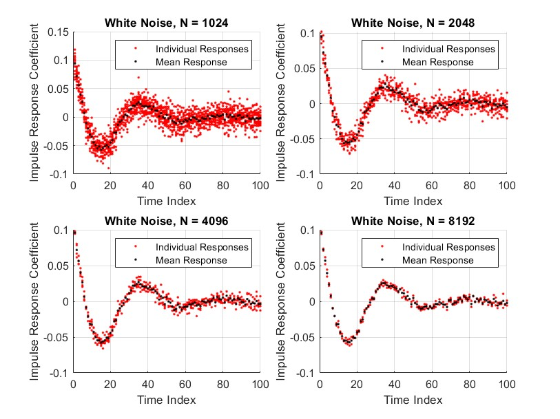
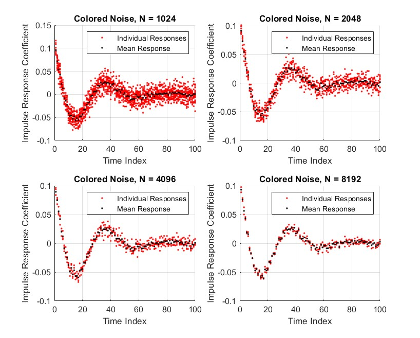
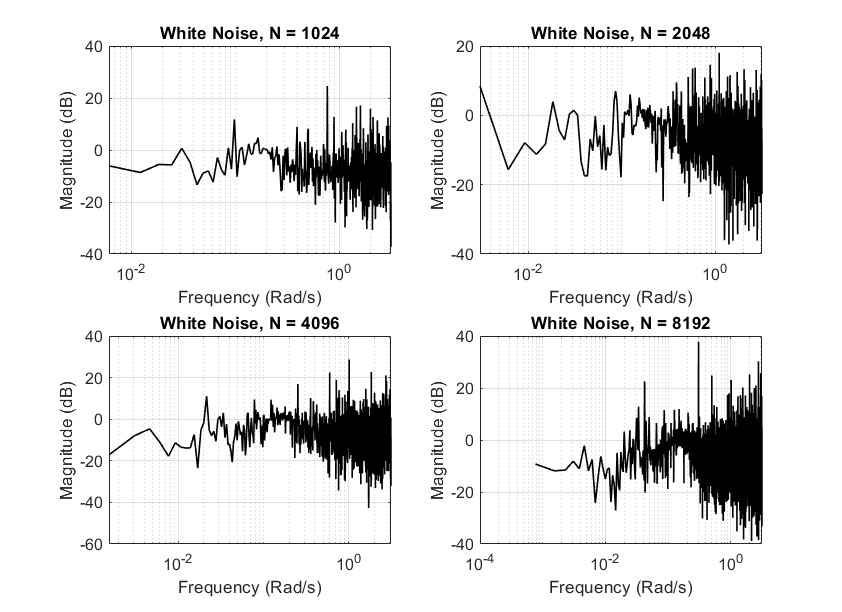
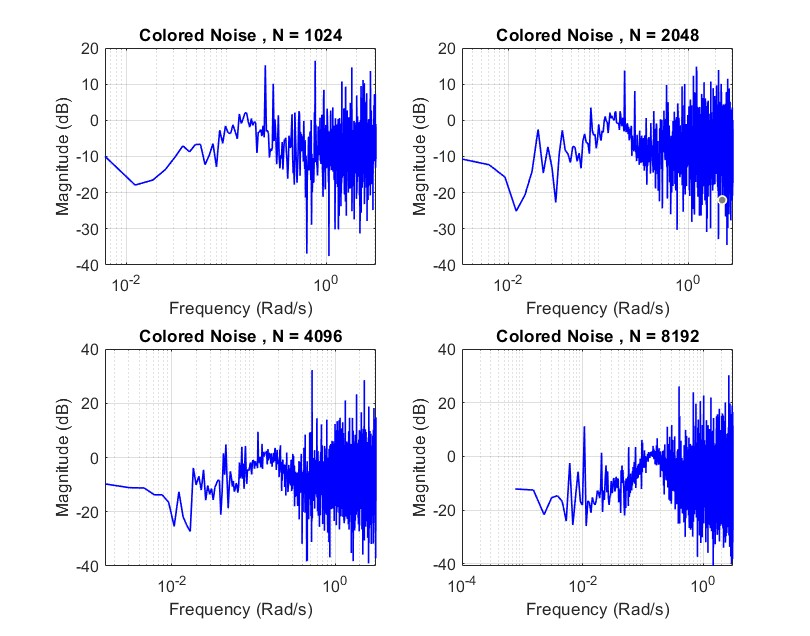
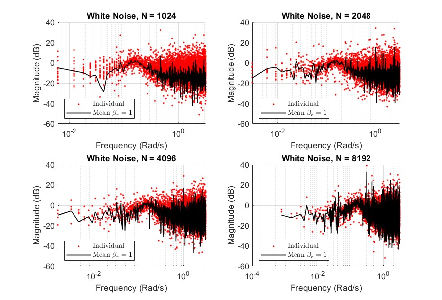
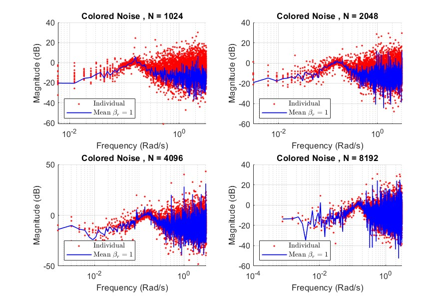
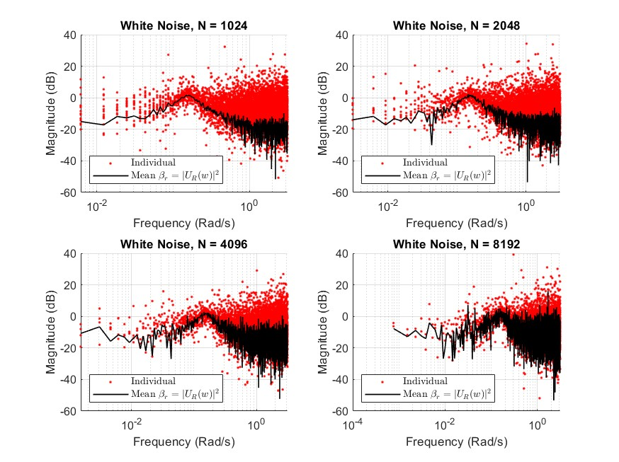
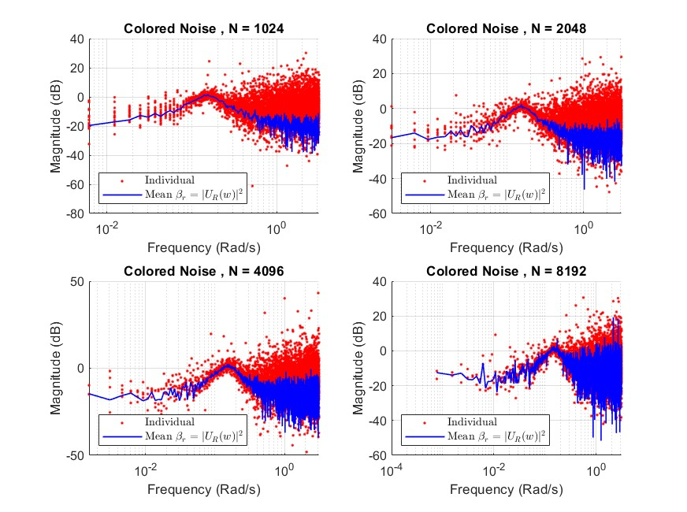

# System Identification Using Simulated Data

This directory contains MATLAB code for a system identification project performed on simulated data. The project follows methodologies from Lennart Ljung's *System Identification: Theory for the User*, using both **nonparametric** and **parametric** modeling techniques.

## Table of Contents
- [Dataset](#-dataset)
- [Nonparametric Methods](#nonparametric-methods)
  - [Correlation Analysis](#correlation-analysis)
  - [ETFE](#etfe-empirical-transfer-function-estimate)
  - [Mean ETFE](#mean-etfe-averaged-etfe)
  - [SPA](#spa-spectral-analysis)

## 📊 Dataset

The dataset consists of a single `.mat` file located in this directory and contains four columns:

- `uw` – Input signal
- `yw` – Output corresponding to `uw` (white noise)
- `uc` – Input signal 
- `yc` – Output corresponding to `uc` (colored noise)

The true system that generated this data is unknown.

**MATLAB File:** `data1.mat`

## Nonparametric Methods

These methods help estimate system characteristics directly from data without fitting a parametric model.

---

### Correlation Analysis

**Description:**  
Correlation analysis estimates the system's impulse response by computing the cross-correlation between the input and output signals. This approach assumes a linear time-invariant system and white input noise. The impulse response provides insight into the system's dynamics, such as delay and transient behavior.

The analysis also includes checking the autocorrelation of the residuals to determine if the remaining noise is uncorrelated (i.e., white). This is important for validating the assumptions of the model and identifying potential structure in the noise that the model fails to capture.

In this project, the effect of the averaging data size \( N \) on the correlation estimates was evaluated using four different values: **1024**, **2048**, **4096**, and **8192**. 

**Dataset Size:** 16,384 rows

**MATLAB File:** `S1correlation.m`

**Plots:**

- Evaluated impulse responses ( system with white noise ):
  

- Evaluated impulse responses ( system with colored noise ):
  

---

### ETFE (Empirical Transfer Function Estimate)

**Description:**  
ETFE provides a raw estimate of the frequency response by dividing the FFT of the output by the FFT of the input. It's fast but may be noisy due to lack of smoothing.

**MATLAB File:** `S1ETFE.m`

**Plots:**

- ETFE magnitude ( system with white noise ):
  

- ETFE magnitude ( system with colored noise ):
  

---
### Mean ETFE (Averaged ETFE)

**Description:**

This section improves upon the basic ETFE method by reducing variance through averaging. The dataset is split into multiple equal-length segments, and the ETFE is computed separately for each segment. These individual estimates are then averaged to produce a smoother and more reliable frequency response.

Two common averaging methods are used:

#### Method 1: Uniform Averaging

- **Weighting:** Each segment contributes equally to the final average, regardless of signal strength or noise characteristics.

**MATLAB File:** `S1METFE1.m`

**Plot:**

- Mean ETFE magnitude ( system with white noise ):
  

- Mean ETFE magnitude ( system with colored noise ):
  

#### Method 2: Weighted by Input Spectrum Magnitude

- **Weighting:** Segments are weighted according to the power of their input signal at each frequency. This gives more influence to segments with stronger input energy, which typically results in a lower-variance estimate.

**MATLAB File:** `S1METFE2.m`

**Plot:**

- Mean ETFE magnitude ( system with white noise ):
  

- Mean ETFE magnitude ( system with colored noise ):
  
---

### SPA (Spectral Analysis)

**Description:**  
The Spectral Analysis (SPA) method is an alternative to ETFE that addresses some of its limitations. Unlike ETFE, SPA applies a frequency-domain window to smooth the estimate and reduce variance. This technique allows better observation of the system's behavior around a specific frequency by averaging nearby frequencies.

The SPA estimate is computed by weighting the ETFE values of each segment using a frequency window centered at the frequency of interest. This results in a smoother and more reliable frequency response estimate, particularly useful in noisy environments.

Several window types are used for this purpose, including:

- Constant
- Parzen
- Hamming
- Bartlett

These windows determine how the data is weighted across neighboring frequencies during averaging. The choice of window affects the trade-off between bias and variance in the frequency response estimate.

**MATLAB File:** `S1SPA.m`

**Plots:**

- SPA magnitude ( system with white noise ):
  

- SPA magnitude ( system with colored noise ):
  

---

